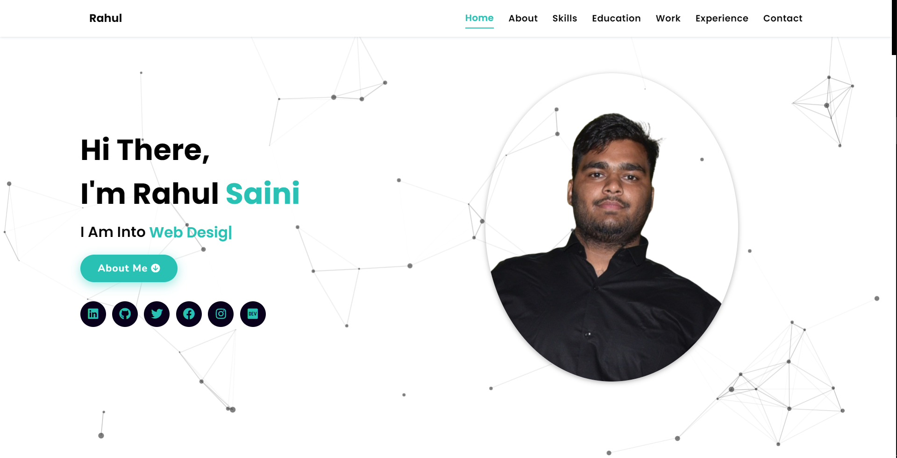
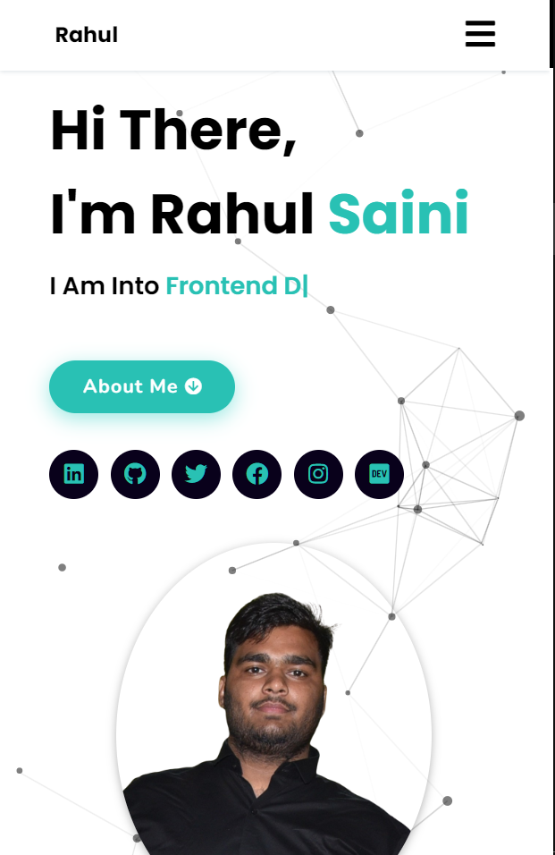

# Responsive Portfolio Website Rahul

### Responsive Portfolio Website Rahul

- Responsive Personal Portfolio Website Using HTML CSS & JavaScript
- Smooth scrolling in each section.
- Developed first with the Mobile First methodology, then for desktop.
- Compatible with all mobile devices and with a beautiful and pleasant user interface.

### LIVE DEMO :

Web-Page : https://meetawa.github.io/

### TOOLS USED :

### DESKTOP DEMO :

### MOBILE DEMO :

---

👋 Hello, I'm Rahul Saini.

🚀 Follow Me:

- [Twitter](https://twitter.com/rahumeetawa)
- [LinkedIn](https://www.linkedin.com/in/rahul-saini-3950501a2/)

---
